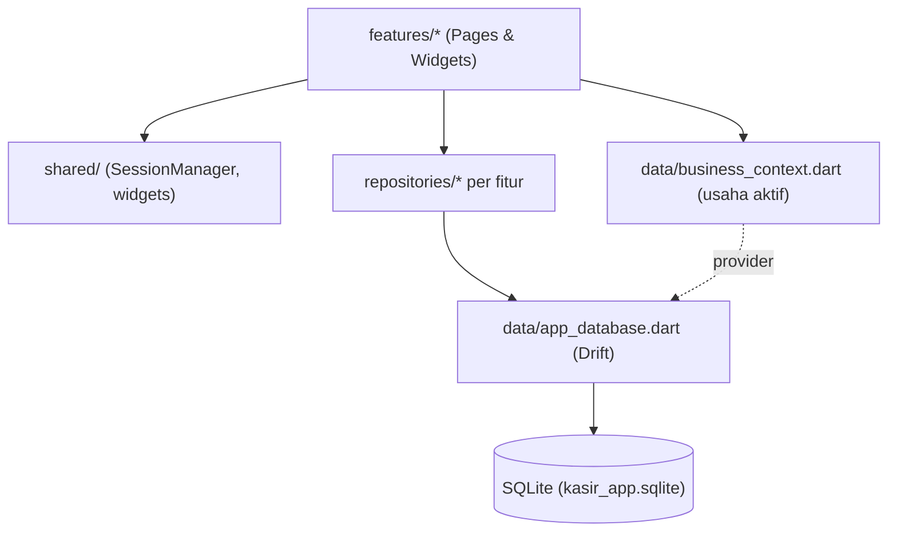

# Arsitektur Kasir App

Dokumen ini adalah **peta besar** kode. Tujuannya: kamu tahu *di mana* sesuatu
berada dan *aturan main* yang membuat kode ini tetap konsisten — bukan
penjelasan baris per baris (kode bisa berubah; prinsip di sini jarang berubah).

---

## 1. Gambaran umum

Kasir App adalah aplikasi POS **local-first** (semua data di SQLite pada
perangkat) yang menangani **beberapa usaha dalam satu aplikasi**. Masalah inti
yang dipecahkan:

1. **Multi-business** — 1 owner punya beberapa usaha; data tiap usaha harus
   terpisah rapi walau disimpan di 1 database.
2. **Peran & izin** — Owner (akses penuh) vs Kasir (akses terbatas, bisa diatur).
3. **Siap sinkronisasi (Phase 2)** — walau sekarang offline, struktur data sudah
   disiapkan agar nanti bisa sync ke cloud tanpa merombak skema.

## 2. Peta kode (codemap)

```
lib/
├── main.dart              # Entry point. Inisialisasi + routing berdasar status login.
│
├── app/
│   ├── app_shell.dart     # Kerangka utama setelah login: drawer + isi halaman.
│   │                        Menu difilter sesuai permission user.
│   └── app_theme.dart     # buildAppTheme(seed) — 1 tema, warna dihitung dari "seed"
│                            per tipe usaha (dine-in oranye, grab-and-go monokrom).
│
├── data/                  # LAPISAN DATA (semua soal database ada di sini)
│   ├── app_database.dart  # Definisi tabel Drift + SEMUA query + strategi migrasi.
│   ├── app_database.g.dart# Hasil generate build_runner (JANGAN diedit manual).
│   ├── business_context.dart # Singleton: usaha mana yang sedang aktif.
│   ├── db.dart            # Instance global `db` + "wiring" BusinessContext ke DB.
│   ├── uuid_helper.dart   # newUuid() untuk ID sync-friendly.
│   └── models/            # Model bantu (ReportSummary, SaleLine, TopProduct, dll).
│
├── features/             # LAPISAN FITUR (feature-first: 1 folder = 1 modul)
│   ├── auth/             #   login, setup owner, recovery code, AuthSession, repo
│   ├── onboarding/       #   wizard pertama kali: owner + seed 2 usaha
│   ├── business/         #   halaman daftar & detail usaha, service switch usaha
│   ├── dashboard/        #   halaman utama + kartu ringkasan
│   ├── products/         #   kelola produk & kategori
│   ├── sales/            #   Kasir/POS: keranjang, pembayaran
│   ├── history/          #   riwayat transaksi
│   ├── report/           #   laporan harian/bulanan + export Excel
│   ├── reports/          #   repo & widget laporan shift (dipakai fitur shift)
│   ├── shift/            #   Pantau Shift (owner) + detail shift
│   ├── expenses/         #   catat pengeluaran per shift
│   ├── owner/            #   kelola kasir + atur izin
│   └── settings/         #   mode device
│
├── shared/               # LAPISAN BERSAMA (dipakai lintas fitur)
│   ├── auth/session_manager.dart # Singleton: sesi login + pengecekan permission
│   ├── constants/        #   konstanta app, spacing, text styles
│   └── widgets/          #   widget reusable (toast, dialog, logo, dsb.)
│
└── utils/                # Formatter (rupiah, tanggal) + kripto (PBKDF2) + helper
```

Aturan lapisan: **UI (features) → data/shared → drift**. Halaman & widget
mengambil data lewat `db` (AppDatabase) atau *repository*, **tidak** menulis SQL
mentah sendiri.

## 3. Alur startup (`main.dart`)

```
main()
 ├─ initializeDateFormatting('id_ID')      # format tanggal lokal Indonesia
 ├─ SessionManager.restoreSession()        # pulihkan sesi login (kalau ada)
 ├─ BusinessContext.loadPersistedForBranding()  # warna/logo halaman login
 └─ runApp(MyApp)
       └─ AuthFlowHandler menentukan halaman awal:
            ├─ belum ada user      → OnboardingPage (wizard pertama kali)
            ├─ belum ada owner     → OwnerSetupPage (jalur cadangan)
            ├─ belum login         → LoginPage
            └─ sudah login         → AppShell (aplikasi utama)
```

`MyApp` membungkus `MaterialApp` dengan `ListenableBuilder` ke `BusinessContext`.
Saat usaha aktif berganti, `key` MaterialApp ikut berganti → seluruh widget tree
dibangun ulang ("soft restart") sehingga tema & data ganti bersih.

## 4. Pola-pola kunci

### a. State global via Singleton `ChangeNotifier`
Dua "otak" aplikasi:

- **`BusinessContext`** (`data/business_context.dart`) — menyimpan **usaha aktif**
  + daftar usaha yang boleh diakses user. UI dengar perubahan lewat
  `ListenableBuilder`. Method penting: `loadInitial()` (setelah login),
  `switchTo()` (ganti usaha), `clear()` (logout).
- **`SessionManager`** (`shared/auth/session_manager.dart`) — menyimpan **sesi
  login** (`AuthSession`) + fungsi cek izin. Sesi juga di-*persist* ke
  `shared_preferences`.

### b. Database di-*scope* otomatis per usaha 🔑
Hampir semua data punya kolom `business_id`. Supaya kita tidak lupa memfilter,
`AppDatabase` punya "jembatan":

```dart
// di db.dart — dijalankan sekali saat `db` pertama diakses:
AppDatabase.activeBusinessIdProvider =
    () => BusinessContext.instance.activeBusinessId;
```

Lalu setiap query operasional memakai `_getActiveBusinessId()` /
`_requireActiveBusinessId()` untuk menambahkan `WHERE business_id = ?` secara
otomatis. **Akibatnya:** kamu tidak perlu (dan tidak boleh) menulis query yang
mengabaikan usaha aktif — data antar usaha tidak akan pernah bocor satu sama
lain.

> **Kenapa lewat "provider" dan bukan import langsung?** `business_context.dart`
> meng-import `app_database.dart`. Kalau `app_database.dart` balik meng-import
> `business_context.dart`, terjadi **circular import** (dilarang). Jembatan
> fungsi ini memutus lingkaran itu.

### c. Skema *sync-friendly* (siap Phase 2)
Setiap tabel data bisnis memakai pola yang sama:

- **UUID** sebagai primary key (`newUuid()`), bukan angka auto-increment —
  supaya ID tetap unik lintas perangkat saat sync nanti.
- Kolom **`createdAt`, `updatedAt`, `deletedAt`, `syncStatus`** di setiap tabel.
- **Soft-delete**: menghapus = mengisi `deletedAt` (baris tetap ada), bukan
  benar-benar dihapus. Query selalu menyaring `deletedAt IS NULL`.

Detail lengkap: [database-schema.md](database-schema.md).

### d. Izin (permission) — 2 lapis
Ada dua mekanisme cek izin (peninggalan evolusi menuju multi-business):

1. **Global** — `SessionManager.hasPermission(code)`. Owner selalu `true`; kasir
   sesuai daftar izin yang diaktifkan di DB (`user_permissions`). Dipakai untuk
   memfilter menu drawer & sebagai penjaga di lapisan DB (`requirePermission`).
2. **Kontekstual per-usaha** — `SessionManager.hasCurrentPermission(code)`.
   Berdasar **role user di usaha aktif** (di-cache dari `user_business_roles`)
   dicocokkan ke matriks role (`_rolePermissions`). Dipakai fitur yang terkait
   usaha aktif (mis. `manage_business`, `view_all_shifts`).

> Keduanya masih berdampingan saat ini. Kalau menambah pengecekan izin baru,
> ikuti pola fitur sejenis yang sudah ada, dan lihat daftar kode izin di
> [database-schema.md](database-schema.md).

### e. Keamanan
- **PIN**: di-hash **PBKDF2-HMAC-SHA256, 120.000 iterasi** + salt acak, dengan
  format `pbkdf2:<iter>:<base64>`. Perbandingan *constant-time* (anti timing
  attack). Hash lama (SHA-256) masih bisa login lalu **otomatis di-*rehash*** ke
  PBKDF2 (`utils/crypto_utils.dart`).
- **Rate limiting**: gagal login/recovery beruntun → akun terkunci sementara
  dengan *exponential backoff* (60 dtk → 5 mnt → 30 mnt → 1 jam → 24 jam setiap
  kelipatan 5 percobaan).
- **Sesi anti-tamper**: saat `restoreSession()`, role & permission **selalu
  di-ambil ulang dari DB** — nilai di storage tidak dipercaya (mencegah
  privilege escalation). Sesi kedaluwarsa setelah 12 jam.
- **Recovery code** owner untuk reset PIN bila lupa.

### f. Shift (lihat juga [features-overview.md](features-overview.md))
- **Kasir**: login → otomatis membuka shift di usaha aktif; logout / ganti usaha
  → shift ditutup (`endAt` diisi).
- **Owner**: **tidak** menjalankan shift (`shiftId` = `null`). Owner memantau
  shift kasir lewat halaman **Pantau Shift**.

### g. Tema dinamis per usaha
Satu fungsi `buildAppTheme(seed)` di `app/app_theme.dart`. Warna diturunkan dari
`seed` yang dipilih berdasar tipe usaha. Ganti usaha = ganti seed = seluruh
tampilan ikut menyesuaikan tanpa menyentuh halaman mana pun.

## 5. Invariants (aturan yang TIDAK boleh dilanggar)

Ini hal-hal yang sulit ditebak hanya dari membaca kode, tapi wajib dijaga:

1. **Semua query data bisnis di-scope `business_id` aktif.** Jangan menulis query
   yang mengambil data lintas usaha. Gunakan helper yang sudah ada.
2. **Tabel data bisnis wajib punya** `id (UUID)`, `createdAt`, `updatedAt`,
   `deletedAt`, `syncStatus`. Tanpa ini, sync Phase 2 akan rusak.
3. **Penghapusan data bisnis idealnya soft-delete** (isi `deletedAt`).
   *Catatan jujur:* saat ini transaksi sudah soft-delete, tapi beberapa operasi
   (produk/kategori/pengeluaran) masih hard-delete — ini utang teknis menuju
   Phase 2, jangan ditambah.
4. **Owner tidak punya shift.** Kode yang menyangkut shift harus tahan
   `shiftId == null`.
5. **Jangan percaya role/permission dari storage** — selalu validasi dari DB.
6. **`app_database.dart` tidak boleh import `business_context.dart`** (circular).
   Pakai `activeBusinessIdProvider`.
7. **Jangan edit `app_database.g.dart` manual** — itu hasil generate.

## 6. Roadmap: Phase 1 → Phase 2

| | Phase 1 (SEKARANG) | Phase 2 (RENCANA) |
|---|---|---|
| Penyimpanan | SQLite lokal saja | + sinkronisasi cloud (Firebase/Supabase) |
| Data | 1 device | multi-device per usaha |
| Kolom sync | sudah ada tapi belum dipakai | dipakai untuk push/pull perubahan |
| Migrasi skema | *fresh-start* boleh (data masih dummy) | **wajib preserve data** (dilarang drop table) |
| Pantau Shift (owner) | hanya lihat data di device ini | lihat shift kasir dari device lain (setelah sync) |

> ⚠️ Migrasi `v10` melakukan *drop & recreate* tabel (fresh-start) karena datanya
> masih dummy. **Pola ini tidak boleh dipakai lagi** begitu ada data client
> sungguhan — Phase 2 harus menjaga data lama. Lihat [database-schema.md](database-schema.md).

## 7. Diagram lapisan (ringkas)


