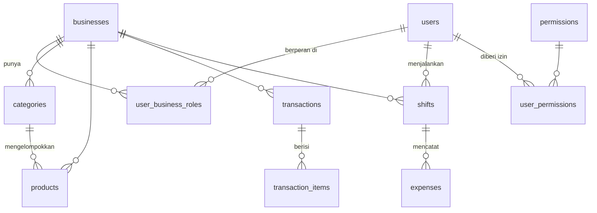

# Skema Database

Database memakai **SQLite** lewat **Drift** (ORM). Semua definisi tabel + query
ada di satu file: **`lib/data/app_database.dart`**. Versi skema saat ini:
**`schemaVersion = 10`**.

> File `app_database.g.dart` adalah hasil generate `build_runner` dari definisi
> tabel — **jangan diedit manual**.

---

## 1. Pola wajib di setiap tabel data bisnis

Sebelum melihat daftar tabel, pahami dulu pola yang **selalu** dipakai (agar
siap sinkronisasi cloud di Phase 2):

| Kolom | Tipe | Fungsi |
|---|---|---|
| `id` | TEXT (UUID) | Primary key. Dibuat dengan `newUuid()` — unik lintas perangkat. |
| `businessId` | TEXT (FK → businesses) | Menandai data ini milik usaha yang mana. |
| `createdAt` | DateTime | Kapan dibuat. |
| `updatedAt` | DateTime | Kapan terakhir diubah (dipakai sync). |
| `deletedAt` | DateTime? | Kalau terisi = dianggap terhapus (**soft-delete**). |
| `syncStatus` | TEXT | Status sinkronisasi (default `'pending'`). |

**Konsekuensi penting:**
- Query selalu menyaring `deletedAt IS NULL` (data terhapus disembunyikan).
- Query data bisnis selalu menyaring `business_id = <usaha aktif>` — dilakukan
  otomatis (lihat [architecture.md](architecture.md) §4b).

Pengecualian: tabel `users` tidak punya `businessId` (user bersifat global,
relasinya ke usaha lewat `user_business_roles`); `permissions` &
`user_permissions` adalah tabel referensi/izin tanpa kolom sync.

---

## 2. Daftar tabel

### Inti multi-business
- **`businesses`** — data usaha (`name`, `type`, `logoPath`, `address`, `phone`,
  `isActive`). `type` = `restaurant_dinein` atau `beverage_grabandgo`.
- **`user_business_roles`** — relasi **banyak-ke-banyak** user ↔ usaha, plus
  `role` user di usaha itu (`owner` / `cashier`). PK gabungan (`userId`,
  `businessId`).

### Katalog produk
- **`categories`** — kategori produk (`name`, `iconCodepoint`), milik 1 usaha.
- **`products`** — produk (`name`, `price`, `barcode`, `categoryId`,
  `hasSpicyOption`, `imagePath`).

### Transaksi / penjualan
- **`transactions`** — header transaksi (`total`, `paymentMethod` [`cash`/`qris`],
  `cashReceived`, `change`, `cashierUserId`, `shiftId`, `orderType`
  [`dine_in`/`take_away`/`delivery`]).
- **`transaction_items`** — baris item per transaksi (`productId`, `productName`,
  `qty`, `priceAtSale`, `subtotal`, `notes`). `productName` & `priceAtSale`
  disimpan (snapshot) supaya struk lama tetap benar walau produk berubah.
  FK ke `transactions` dengan `ON DELETE CASCADE`.

### Pengguna & shift
- **`users`** — akun (`username` unik, `pinHash`, `salt`, `role`, `isActive`).
  Juga menyimpan data **recovery code** (`recoveryHash`, dst.) & **rate-limit**
  (`loginAttempts`, `loginLockedUntil`, `recoveryAttempts`,
  `recoveryLockedUntil`). Tidak punya `businessId` (global).
- **`shifts`** — sesi kerja kasir (`userId`, `businessId`, `startAt`, `endAt`).
  `endAt` null = shift masih berjalan.

### Izin
- **`permissions`** — daftar referensi kode izin (`code`, `name`, `description`).
  Di-*seed* otomatis.
- **`user_permissions`** — izin yang diaktifkan per user (`userId`,
  `permissionCode`, `enabled`).

### Keuangan
- **`expenses`** — pengeluaran per shift (`shiftId`, `userId` pembuat,
  `updatedByUserId`, `description`, `amount`), milik 1 usaha.

---

## 3. Relasi antar tabel



---

## 4. Daftar kode izin (di-seed)

Di-*seed* lewat `_seedPermissions()` saat database dibuat:

| Kode | Arti |
|---|---|
| `open_close_shift` | Buka/tutup shift |
| `create_transaction` | Membuat transaksi (Kasir) |
| `view_history` | Lihat riwayat transaksi |
| `view_report` | Lihat laporan & analitik |
| `manage_products` | Kelola produk & kategori |
| `manage_cashiers` | Kelola akun kasir |
| `edit_own_expense` / `edit_any_expense` | Edit pengeluaran sendiri / siapa pun |
| `delete_own_transaction` / `delete_any_transaction` | Hapus transaksi sendiri / siapa pun |
| `view_shift_reports` | Buka halaman Pantau Shift |
| `view_all_shifts` | Lihat shift semua kasir (bukan hanya sendiri) |
| `manage_business` | Kelola pengaturan usaha |
| `switch_business` | Berpindah usaha aktif |

Owner otomatis mendapat semua izin. Izin kasir diatur owner lewat halaman
**Kelola Kasir → atur izin**.

---

## 5. Migrasi database

Perubahan skema dikelola **bertahap** (incremental) di `MigrationStrategy`
(`app_database.dart`). Ringkasnya:

- `onCreate` → buat semua tabel + seed izin (untuk install baru).
- `onUpgrade(from, to)` → jalankan blok migrasi sesuai versi. Tiap blok memakai
  pola `if (from < N && to >= N)` supaya aman walau upgrade melompati banyak
  versi.

### Cara menambah kolom / tabel (langkah untuk pemula)

1. Ubah/ tambah definisi tabel di `app_database.dart`.
2. **Naikkan** `schemaVersion` (mis. `10` → `11`).
3. Tambah blok migrasi baru di `onUpgrade`:
   ```dart
   if (from < 11 && to >= 11) {
     await m.addColumn(products, products.kolomBaru);
     // atau: await m.createTable(tabelBaru);
   }
   ```
4. Generate ulang kode:
   ```bash
   dart run build_runner build --delete-conflicting-outputs
   ```
5. Jalankan `flutter analyze` + `flutter test`.

> **Untuk tabel baru**, jangan lupa sertakan kolom sync wajib (§1) dan daftarkan
> tabel di anotasi `@DriftDatabase(tables: [...])`.

### ⚠️ Peringatan migrasi `v10`

Migrasi ke v10 melakukan **drop & recreate** semua tabel lama (fresh-start),
karena saat itu datanya masih dummy. **Pola destruktif ini tidak boleh dipakai
lagi** setelah aplikasi dipakai client dengan data sungguhan — migrasi Phase 2
**wajib menjaga data lama** (gunakan `addColumn` / `createTable`, bukan
`deleteTable`).

---

## 6. Lokasi file database

File SQLite: `kasir_app.sqlite` di folder dokumen aplikasi
(`getApplicationDocumentsDirectory()`). Fungsi `deleteDatabaseFile()` tersedia
untuk menghapusnya (mis. saat testing/reset).
